======================
Codebook Construction
======================

The codebook objects in ``mlcomm`` intend to make organization of the beamforming vectors each.  Each beamforming vector is also an object ``Node`` containing many useful attributes that relate it to it's position in the graph.  The main user customizable parameters include:

- Number of antenna elements in your Uniform Linear Array (ULA)
- Number of RF chains for the hybrid analog-digital configuration
- Number of streams (currently defaults to a single stream)
- The extent of the angular coverage specified in the minimum and maximum angles

The plots below are generated using the functions contained in ``mlcomm/tests/codebook_tests.py``.

Binary Codebook
================

For the ``BinaryHierarchicalCodebook``, the user must specify the depth, which dictates the final number of narrow beams.  For example, a depth of 6 generates 64 narrow beams at the lowest level.

.. code-block:: python
    
    from mlcomm.codebooks import *
    
    cb_graph = BinaryHierarchicalCodebook({'depth':6, 'num_elements' : 64, 'num_rf_chains' : 32, 'num_data_streams' : 1, 'min_max_angles_degs' : (30,150)})
    
Now we show off the construction.  Each codebook has a base set at each level 

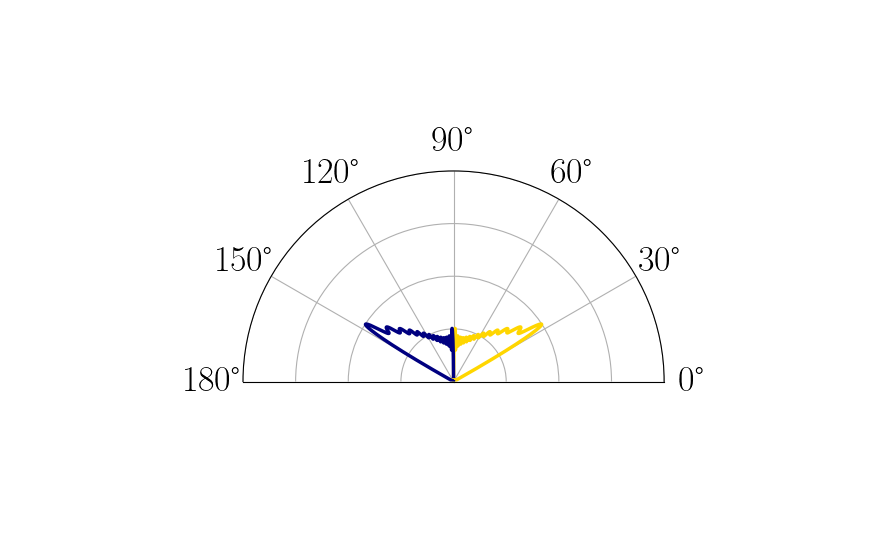

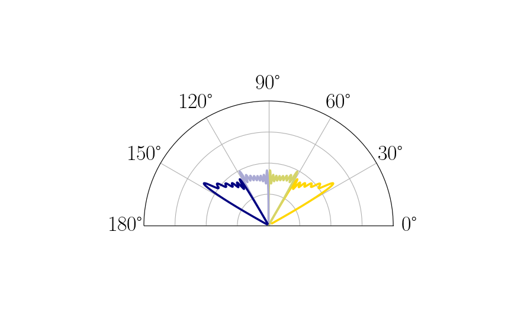

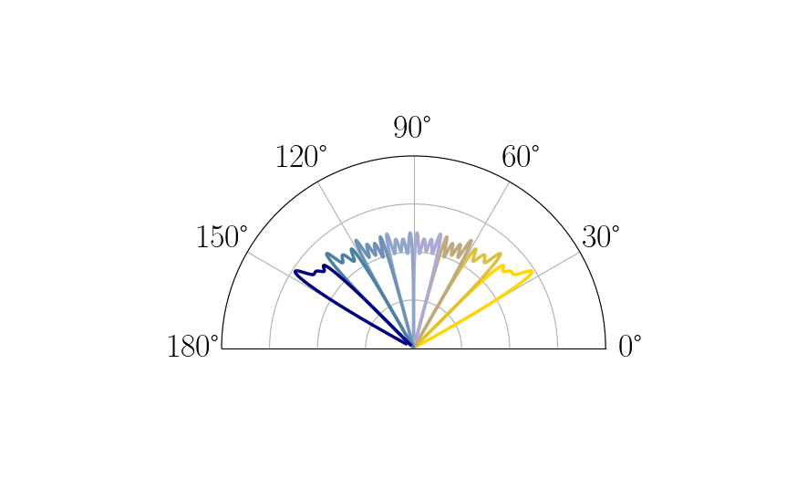

We may also view the hierarchy and what a path for zooming in may look like for two narrow beamforming patterns.

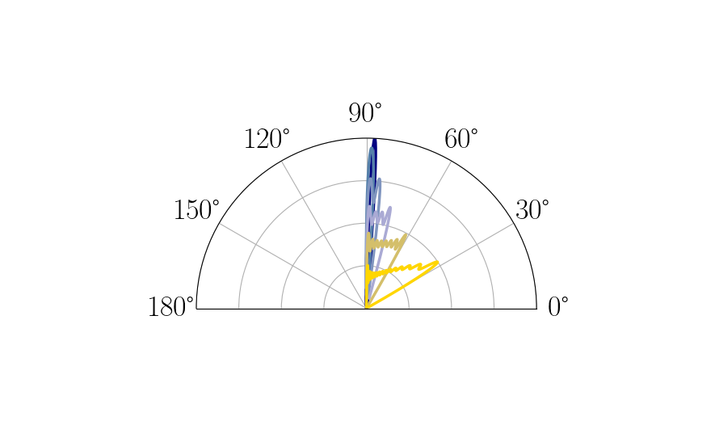

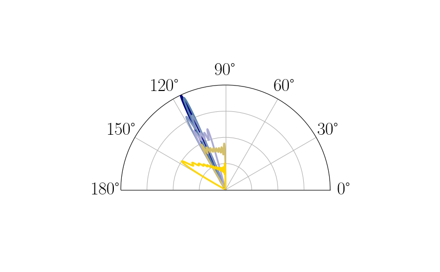

Ternary Codebook 
==================

We further augment the binary codebook to construct ``TernaryHierarchicalCodebook``, first specify the number of broad beamforming vectors, ``num_initial_non_overlapping`` and the ``depth``.

.. code-block:: python
    
    from mlcomm.codebooks import *
    cb_graph = TernaryPointedHierarchicalCodebook({'num_initial_non_overlapping' : 5, 'depth' : 4, 'num_elements' : 128, 'num_rf_chains' : 32, 'num_data_streams' : 1, 'min_max_angles_degs' : (30,150)})
    
The codebook first fans out from the broad beamforming vectors

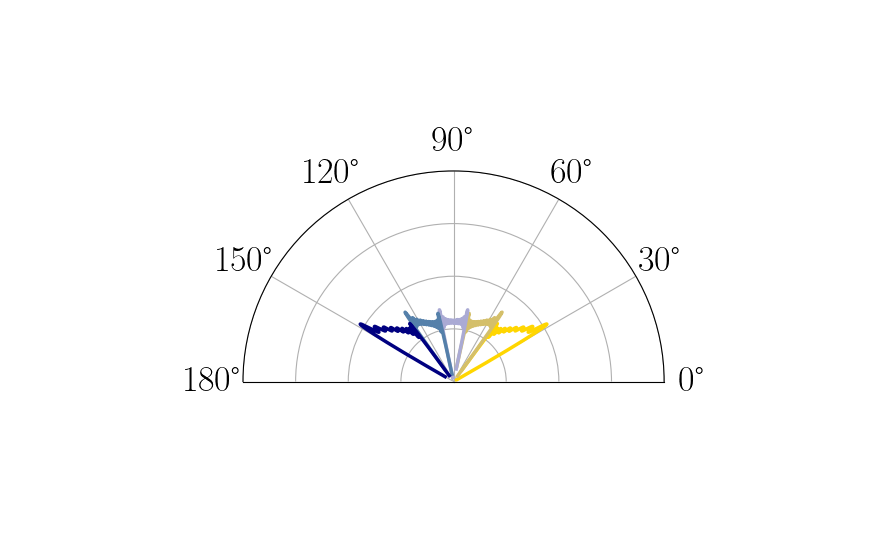
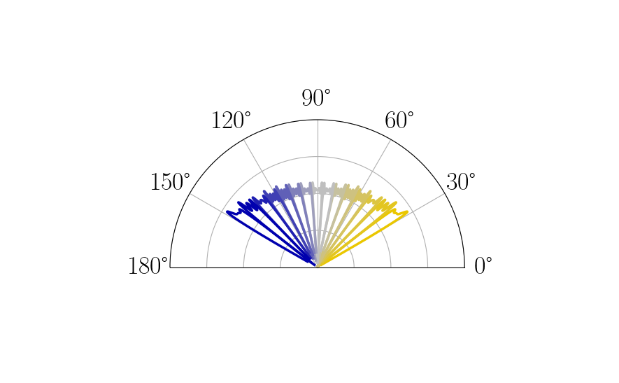
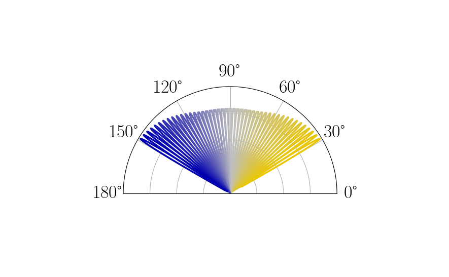
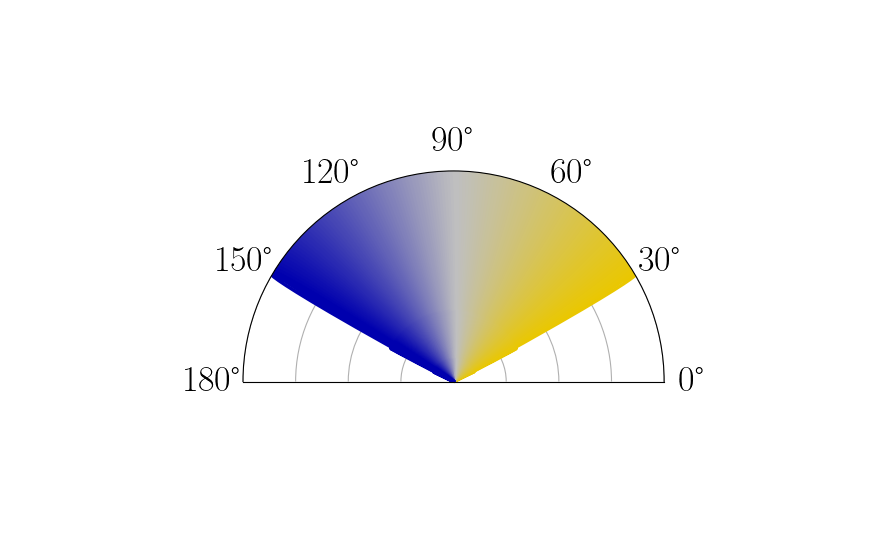

Working backward from the narrowest beam, there is a corresponding broad beam for each narrow one.  This is difficult to see in the figures, so we show a subset of these below.  Note the overlap between the broader beams.  

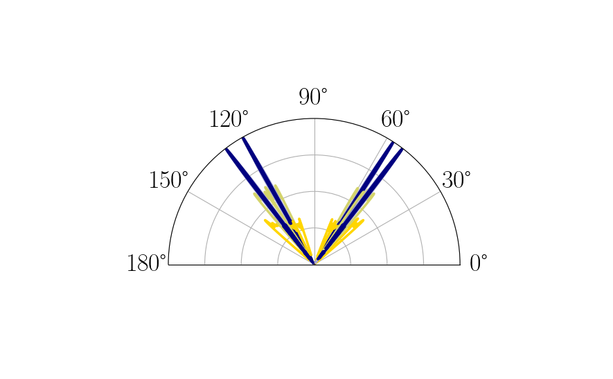

We are now able to zoom out at each pointing angle with the varying beamwidth.

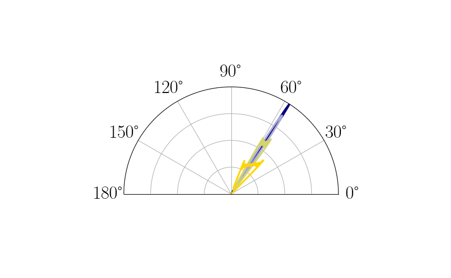
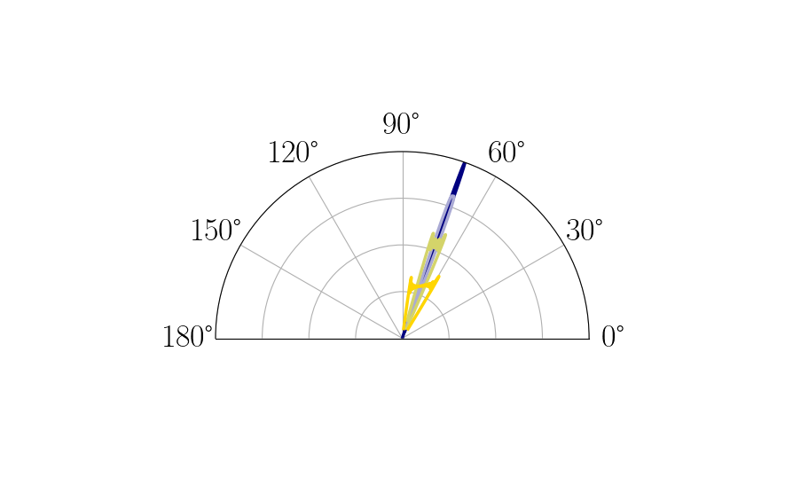
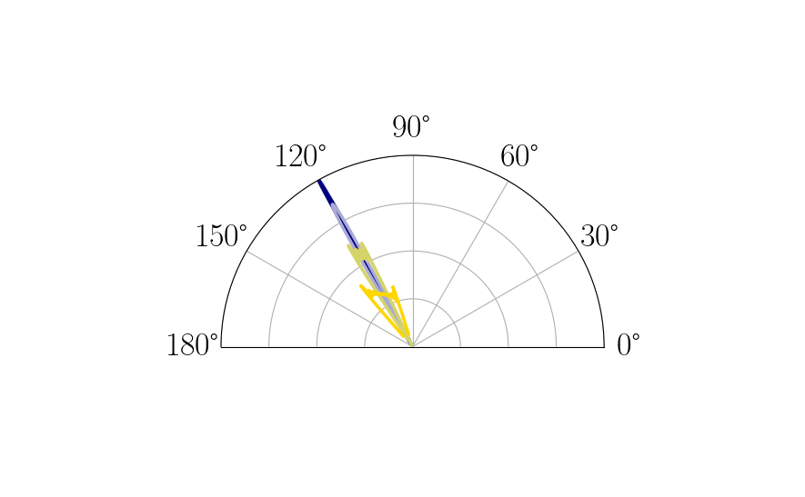

